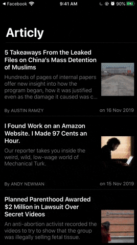

[](https://codebeat.co/projects/github-com-sadmansamee-nybestarticles-master)

# NYArticles
 
* This project was written and compiled using **Xcode 11.2.1**, so if it doesn’t compile wit previous version s of Xcode then please upgarde to **Xcode 11.2.1**.
* This project used [Cocoapod](https://cocoapods.org/) **1.8.4** as a dependency manager.
* This project loads most viewed articles from [NyTimes](https://developer.nytimes.com/) with [most popular APIs](https://developer.nytimes.com/docs/most-popular-product/1/overview). Obtain your own API-KEY and [replace here](https://github.com/Sadmansamee/NyBestArticles/blob/master/NyBestArticles/Shared/Constant/K%2BCredential.swift).(Temporaray it is there for easiness purpose for the reviewer team).




## This project has the following:
* Code from every pull request,master branch check with [Codebeat](https://codebeat.co/) with **A grade**. 
* MVVM design pattern.
* Coordinator pattern for navigation.
* Quick and Nimble for Unit-Test.
* Dependency Injection with [Swinject](https://github.com/Swinject/Swinject)
* RxSwift for MVVM binding.
* [Moya](https://github.com/Moya/Moya) for API call.
* [Realm](https://realm.io/) for persistant storage.


## How to run
* Clone this project.
* **CD** to project folder.
* ```pod install``` or [bundler](https://bundler.io/) is also configured with this project, for that follow [this instruction](https://mikebuss.com/2017/01/21/dependencies-crash-course/) then run ```bundler exec pod install```